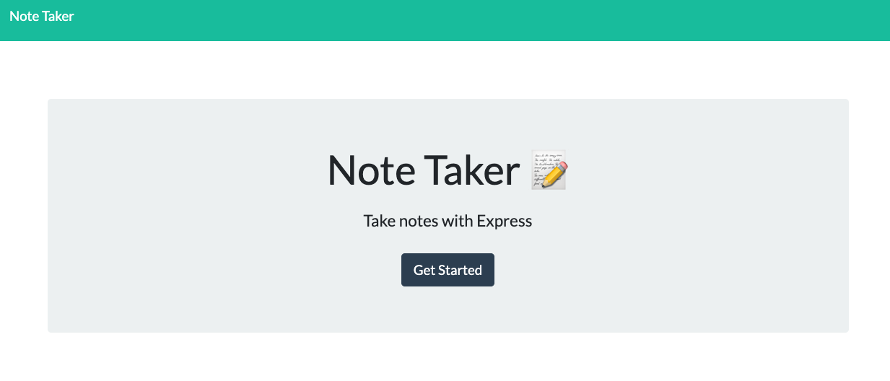
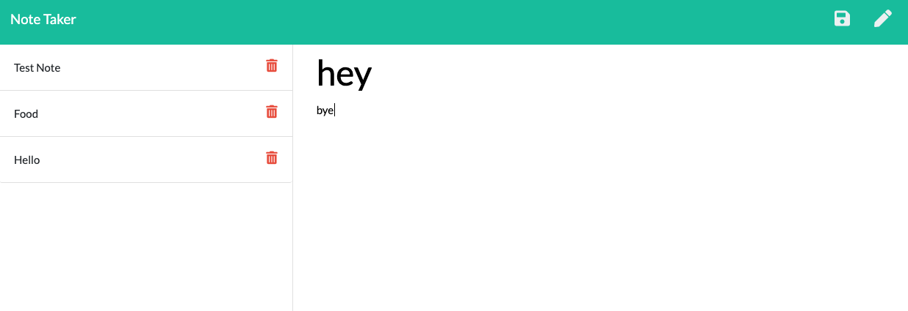

# noteTaker_egomez
  

  ## Description

  This is a web application that enables you to write notes, save the note, and then delete the notes you do not need.

  ## Table of Contents

  -[Installation](#installation)

  -[Usage](#Usage)

  -[License](#license)

  -[Contributing](#contributing)

  -[Tests](#tests)

  -[Questions](#questions)

  ## Installation

  npm install

  ## Usage

  Click on the Get Started button, that will direct you to the page where you can enter the note title and enter the note you need to write. Once both have been filled out, you can save it by hitting the button of the floppy disk top right corner. If you need to delete a note just hit the trash can icon next to the note.

  ## License

  This project is licensed under [MIT](https://opensource.org/licenses/MIT) license.

  ## Contributing

  Just be careful.

  ## Tests

  TBD

  ## Questions

  If you have any questions about the repo, open an issue or contact me directly at egomezfax19@gmail.com. You can find more of my work at [www.github.com/egome019](https://github.com/egome019)
  
  ## Demonstration
  
  [Click here](https://frozen-refuge-34561.herokuapp.com/) to use the application.
  
  

  
